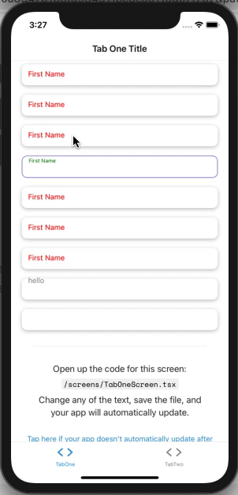

# Fully Customizable Floating Label Input By Fiction Developers
Developed with passion by Fiction Developers to support a very dynamic floating action label, you can modify almost everything by just passing some params, i.e, label Y position when focused, and when unFocused, label's color, fontsize both when focused and unfocused, also the container style, text inptu style with focused/unfocused, and you can even modify the courser/selection color

Note: all text input props are supported too, Except onFocus and onBlur, instead focus and blur events are explained in Full Example below

# Expo 40 Supported Now!

# Install:
```
$ npm i fiction-expo-floating-label-input
```


# Usage:
```js
import {FictionFloatingLabelInput} from "fiction-expo-floating-label";
```

# preview



# basic example:
```js
<FictionFloatingLabelInput
    label="First Name"
    value={x} // just a state variable
    labelFocusedTop={10} // Y position of label when focused
    labelUnFocusedTop={-5} // Y position of label when un-focused
    onChangeText={(t)=>setX(t)} // setting state variable
/>
```


# full example:
```js
<FictionFloatingLabelInput
    label="First Name" // label itself
    value={x} // just a state variable

    labelFocusedTop={-5} // Y position of label when focused
    labelUnFocusedTop={10} // Y position of label when un-focused

    containerStyle={{}} // container style
    focusedContainerStyle={{}} // container style when focused
    unFocusedContainerStyle={{}} // container style when un-focused

    subContainerStyle={{}} // child container style
    focusedSubContainerStyle={{}} // child container style when focused
    unfocusedSubContainerStyle={{}} // child container style when un-focused

    labelStyle={{}} // label style
    focusedLabelStyle={{}} // label style when focused
    unfocusedLabelStyle={{}} // label style when un-focused

    textInputStyle={{}} // text input style
    focusedTextInputStyle={{}} // text input style when focused
    unFocusedTextInputStyle={{}} // text input style when un-focused

    labelFontSizeUnFocused={14} // label font size when un-focused
    labelFontSizeFocused={10} // label font size when focused

    labelColorUnFocused={"red"} // label color when un-focused
    labelColorFocused={"green"} // label color when focused

    underlineColorAndroid={"transparent"} // you know this one, right?

    selectionColor={"red"} // cursor and selection color

    onChangeText={(value)=>setX(value)} // setting state variable

    // all other text input props are supported too, Except onFocus and onBlur, instead below focus and blur events are explained

    preOnFocus={()=>{ 
      // gets called before the animation starts , focusing
    }}

    postOnFocus={()=>{ 
      // gets called after the animation ends , focusing
    }}

    preOnBlur={()=>{ 
      // gets called before the animation starts , unfocusing
    }}

    postOnBlur={()=>{ 
      // gets called after the animation ends, unfocusing
    }}

/>
```

| Prop  | Explaination |
| ------------- | ------------- |
| `Content Cell`  | `String` label itself  |
| `value`  | `string|number` value variable reference of input  |
| `labelFocusedTop`  | `number` Y position of label when focused |
| `labelUnFocusedTop`  | `number` Y position of label when un-focused |
| `containerStyle`  | `Style` container style i.e `{padding:2}` |
| `focusedContainerStyle`  | `Style` container style when focused i.e `{padding:2}` |
| `unFocusedContainerStyle`  | `Style` container style when un-focused i.e `{padding:2}` |
| `subContainerStyle`  | `Style` child container style i.e `{padding:2}` |
| `focusedSubContainerStyle`  | `Style` child container style when focused i.e `{padding:2}` |
| `unfocusedSubContainerStyle`  | `Style` child container style when un-focused i.e `{padding:2}` |
| `labelStyle`  | `Style` label style i.e `{padding:2}` |
| `focusedLabelStyle`  | `Style` label style when focused i.e `{padding:2}` |
| `unfocusedLabelStyle`  | `Style` label style when un-focused i.e `{padding:2}` |
| `textInputStyle`  | `Style` text input style i.e `{padding:2}` |
| `focusedTextInputStyle`  | `Style` text input style when focused i.e `{padding:2}` |
| `unFocusedTextInputStyle`  | `Style` text input style when un-focused i.e `{padding:2}` |
| `labelFontSizeUnFocused`  | `number` label font size when un-focused i.e `12`  |
| `labelFontSizeFocused`  | `number` label font size when focused i.e `12`  |
| `labelColorUnFocused`  | `string` label color when un-focused i.e `red` or `#000` |
| `labelColorFocused`  | `string` label color when focused i.e `red` or `#000` |
| `underlineColorAndroid`  | `string` android input underline default: `transparent` |
| `selectionColor`  | `string`  cursor and selection color |
| `preOnFocus`  | `()=>{ // YOUR CODE HERE }` gets called before the animation starts , focusing  |
| `postOnFocus`  | `()=>{ // YOUR CODE HERE }` gets called after the animation ends , focusing  |
| `preOnBlur`  | `()=>{ // YOUR CODE HERE }` gets called before the animation starts , unfocusing  |
| `postOnBlur`  | `()=>{ // YOUR CODE HERE }` gets called after the animation ends, unfocusing  |
| all <TextInput> props  | `any` All of the text input props are also supported except onFocus & onBlur, instead above 4 lines explain these two  |

Ping me if you have any problems at:
whatsapp: +923009550284
email: csgenius786@gmail.com
skype: faisal284hr

Buy me coffee?
BTC Wallet: 
```
1NwhcTSq3RGFkN5AUfyYdnqbrsbiBEsoiq
```